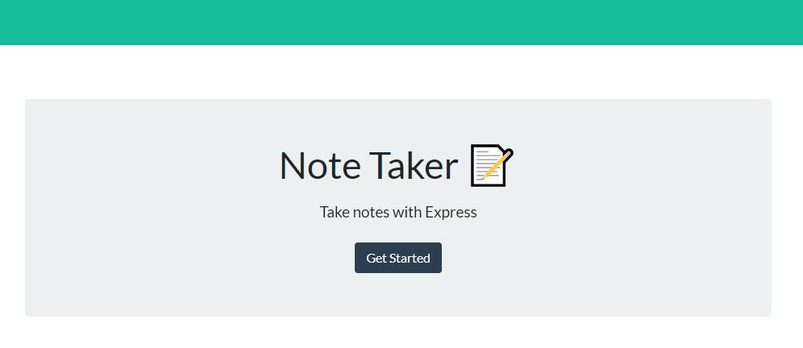

# Note-Taker

 
    
# Description

This is an app that allows users to write, save and delete notes. It uses an express backend and saves and retrieve note data from a JSON file.

The application should have a db.json file on the backend that is used to store and retrieve notes using the fs module.

# User Story

AS A user, I want to be able to write and save notes

I WANT to be able to delete notes I've written before

SO THAT I can organize my thoughts and keep track of tasks I need to complete

# Live Site

https://evening-hamlet-43706.herokuapp.com/

# Usage
 GitHub repo: https://github.com/marianacode/Note-Taker
